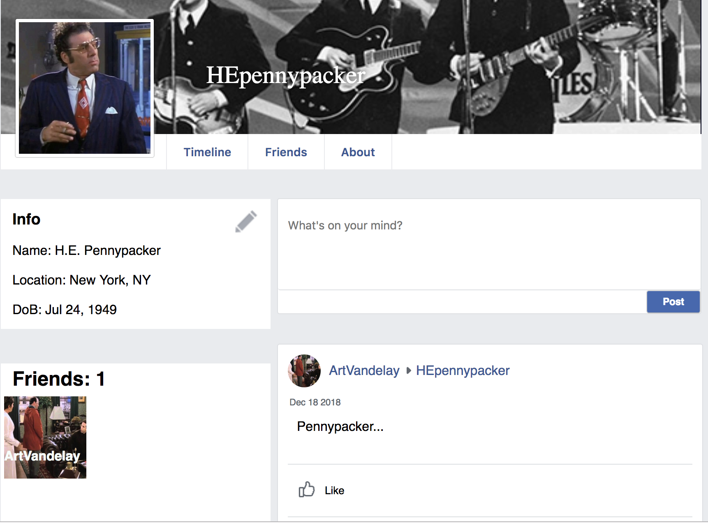

# README

## BookFace  

[Live site link](https://bookface14.herokuapp.com/)  

## Main goal
  The objective here is to make a functional Facebook clone using Ruby on Rails. While it lacks many bells and whistles included in the real Facebook, BookFace aims to support most of Facebook's basic features.

## App Navigation  
  Each user has their own profile page. This is easily denoted by the pictures at the top.  
       
  The profile picture can be updated provided that the profile belongs to the active user.  
  The home feed page is populated by all posts made by the user and their friends.   
  The user's page is populated by that user's own posts and all other posts specifically targeting that user.  
  Users can become friends with each other if one user clicks the 'add friend' button on the other user's profile page and the other accepts the request.  
  A user will be notified via the globe symbol on the floating nav bar if another user posts to their wall, comments on their post, or likes their post.  
  A post can be deleted by the poster by clicking the X at the top right corner of the post.  
  Comments can be made on any post. They can be deleted by the commenter by clicking 'remove' next to the comment text.  
  The search bar will return a list of all users whose username contains the searched text.  
  Lastly, the logout button can be accessed by clicking the downward facing triangle on the upper nav bar.

## Technologies
  BookFace is built using the Ruby on Rails framework. Ruby is used on the backend paired with JavaScript on the frontend.  
  SQL is implemented for querying the backend database.  
  React-Redux along with HTML and CSS are used on the front end to make the app real-time responsive.


## Features

Upon navigating to a user's profile page, BookFace will verify that the current user is friends with the owner of that page. The user can only see the posts to the page owner's wall if the two of them are friends.

```
if (props.all.friendsWith || props.pageOwner === props.all.currentUser) {
  posts = postsToRender.map((post) => {
    return <PostIndexItemContainer post={post} key={post.id}/>;
  });
  postForm = <CreatePostFormContainer pageOwner={props.pageOwner} />;
}
```
In this code `props.all.friendsWith` checks the friendships in the current state. If there exists one between the current user and the owner of the page with a status of 'approved' or if the current user is on their own page the posts will show up.
